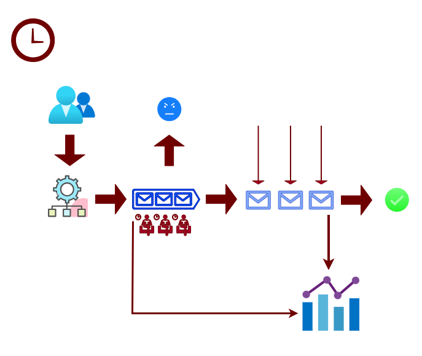

# 💈 Barbershop Simulation

This project simulates the daily activity inside a barbershop.  
Customers arrive over time, wait in a queue if the barbers are busy,  
or leave if the shop is full. Each barber works independently with  
different haircut types and durations. The simulation tracks wait times,  
revenue, wages, idle time, and overall shop efficiency. Time is scaled,  
so an hour-long scenario can play out in just a few moments, making it  
easy to observe how different shop setups perform.



---

## 🎯 Features

- Multiple barbers working at the same time
- Customers show up randomly with different haircut types
- Waiting room with a maximum size
- Customers leave if the shop gets too full
- Time-scaled simulation (runs faster than real life)
- Tracks important shop statistics, including:
  - Customer wait times
  - Number of customers served or lost
  - Revenue, wages, and profit
  - Barber work time vs. idle time
  - Haircut type distribution
- Uses threading to simulate real-time activity
- Code is organized and easy to modify

---

## 📁 Project Structure

```plaintext
barbershop_simulation/
│
├── main.py                  # Entry point to run the simulation
├── config.py                # Simulation settings and constants
├── README.md                # Project description and usage
│
├── models/                  # Core entities
│   ├── __init__.py
│   ├── barber.py
│   ├── customer.py
│   ├── haircut.py
│   └── order.py
│
├── generator/               # Customer and order generators
│   ├── __init__.py
│   ├── customer_generator.py
│   └── order_generator.py
│
├── utils/                   # Utilities and helper scripts
│   ├── __init__.py
│   ├── csv_reshape.py
│   ├── csv_to_bin.py
│   ├── stats_tracker.py
│   └── time_manager.py
│
└── customer_data/           # Data files
    ├── __init__.py
    ├── names.csv
    ├── names_reshaped.csv
    └── names.bin
````

---

## ⚙️ Configuration

Adjust simulation parameters in `config.py`:

| Setting                 | Description                                                           |
| ----------------------- | --------------------------------------------------------------------- |
| `SIMULATION_TIME`       | Total simulation duration in minutes                                  |
| `TIME_DESCALE`          | Time acceleration factor. Higher = simulation runs faster             |
| `CUSTOMER_ARRIVAL_RATE` | Probability of a customer arriving per minute (0–1)                   |
| `WAITING_ROOM_SIZE`     | Maximum number of customers that can wait in the waiting room / queue |
| `NUM_BARBERS`           | Number of barbers serving customers in parallel                       |
| `HOURLY_WAGES`          | Hourly wage for each barber                                           |
| Haircut definitions     | Types of haircuts with price and base duration                        |

### Example Configuration Values

| Setting                 | Example Value   |
| ----------------------- | --------------- |
| `SIMULATION_TIME`       | 60 (in minutes) |
| `TIME_DESCALE`          | 1               |
| `CUSTOMER_ARRIVAL_RATE` | 0.4             |
| `WAITING_ROOM_SIZE`     | 5               |
| `NUM_BARBERS`           | 3               |
| `HOURLY_WAGES`          | 13              |

---

## 🚀 Run the Simulation

```bash
python main.py
```

You’ll see live updates of customer traffic and service completion.
After the simulation ends, a full performance report is printed, including profit. 💰

---

## 🧠 How the Customer Generator Works

For fun, `names.csv` → `names_reshaped.csv` → `names.bin` (binary file).
`CustomerGenerator` then randomly picks names from `names.bin`.

Scripts provided:

```bash
python customer_data/csv_reshape.py
python customer_data/csv_to_bin.py
```

---

## 📊 Example Statistics Output

```
=== Simulation Summary ===

Total Customers Served: 17
Customers Lost: 8
Peak Queue Length: 5

Total Revenue: $253.00
Total Wages: $98.15
Profit: $154.85

Average Customer Wait Time: 12.76 min
Maximum Customer Wait Time: 33 min

Per-Barber Stats:
Barber-2: Haircuts=4, Service=77 min, Idle=36 min, Utilization=68.14%, Idle Ratio=31.86%, Avg Service=19.25 min, Wages=$24.48
Barber-4: Haircuts=6, Service=82 min, Idle=31 min, Utilization=72.57%, Idle Ratio=27.43%, Avg Service=13.67 min, Wages=$24.48
Barber-1: Haircuts=3, Service=84 min, Idle=29 min, Utilization=74.34%, Idle Ratio=25.66%, Avg Service=28.0 min, Wages=$24.48
Barber-3: Haircuts=4, Service=109 min, Idle=5 min, Utilization=95.61%, Idle Ratio=4.39%, Avg Service=27.25 min, Wages=$24.7

Shop-Level Metrics:
Overall Barber Utilization: 77.45%
Average Idle Time per Barber: 25.63 min
Average Revenue per Customer Served: $14.88

Haircut Distribution:
BEARD_TRIM: 3
BEARD_SHAVE: 3
KIDS_CUT: 3
HAIR_BEARD: 3
NORMAL_WASH: 3
DRY: 1
NORMAL: 1
```

*Note: values vary — randomness makes every run unique.*

---

## 📜 License

This project is licensed under the MIT License.
You are free to use, copy, modify, merge, publish, distribute, sublicense, and/or sell copies of the project, under the following conditions:

* You must include the original copyright notice and this permission notice in all copies or substantial portions of the project.
* The software is provided "as is", without warranty of any kind, express or implied.

© 2025
